# MyTask

GAS (Google Apps Script) + Google Sheets で動作する、カンバンタスク管理アプリケーションです。
**データ保存はスプレッドシートでシンプルに、見た目は分かりやすく扱いやすいWebアプリにする** というアプローチで、生成AIと壁打ちして作成しました。

Webアプリの画面とスプレッドシート(データ)の画面
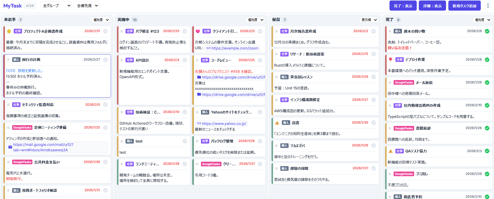
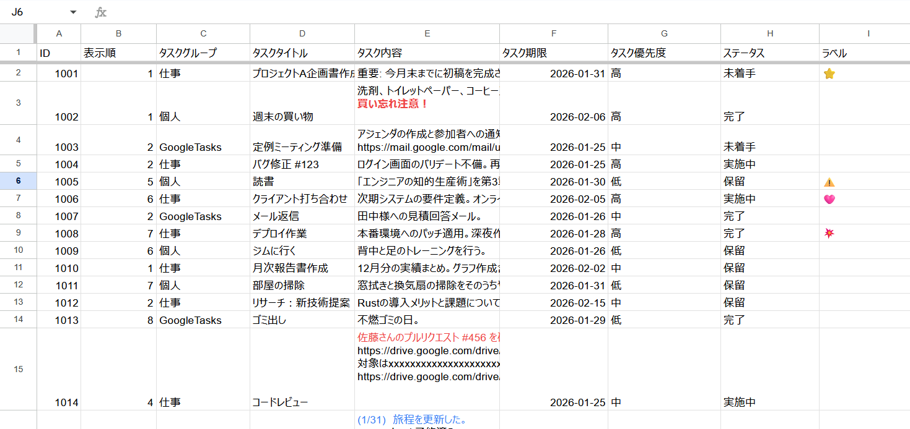

## Features

- **完全無料 & プライベート**: データは全てあなたの Google Drive (スプレッドシート) に保存されます。
- **カンバンボード**: ドラッグ＆ドロップでタスクを直感的に操作。
- **リッチテキスト同期**: 太字や文字色が、Webアプリとスプレッドシート間で双方向に完全同期。
- **Google Tasks 連携**: カレンダーのタスクを一括インポート。
- **モダンなUI**: Glassmorphism を取り入れた、GASとは思えないリッチなデザイン。
- **レイアウト調整**: カラム幅のドラッグリサイズや、表示・非表示のトグル機能。

## Requirement

- Google アカウント
- Google Chrome (推奨)

## Installation

### 1. スプレッドシートの準備
1. 新規スプレッドシートを作成します。
2. デフォルトのシート名を `AccessControl` に変更します。
3. A列に、アプリへのアクセスを許可するメールアドレスを入力します。
   - `A1: xxxxx@yyy.zzz`

   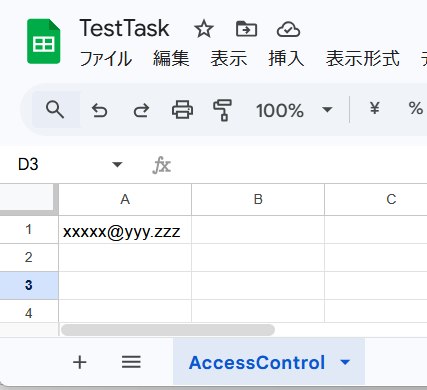
4. スプレッドシートの ID (URLの `/d/` と `/edit` の間の文字列) を控えておきます。
   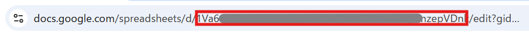

> **Note**: `TaskList` シートはアプリの初回起動時に自動生成されます。

### 2. GASプロジェクトの作成

※ `clasp`の利用ができる方は、末尾のデプロイ手順を参考にしてください。

1. Google Drive で「Google Apps Script」プロジェクトを新規作成します。
   
2. 本リポジトリの `dist` フォルダ内にある以下のファイルをプロジェクトに追加・上書きします（dist内のファイルの生成は末尾のBuild & Bundleを参照）。
   - `Code.gs` (GASエディタ上の `コード.gs`)
      - `dist`フォルダ内の`Code.gs`の内容を貼り付けてください。
   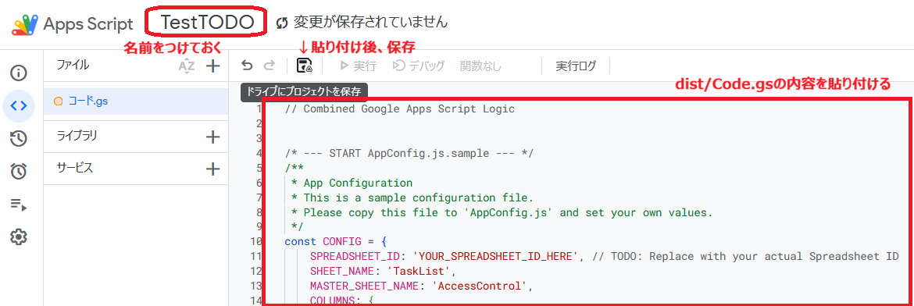
   - `index.html`
      - ファイルの横の＋を押してHTMLを選択します。
      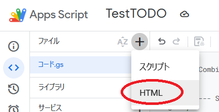
      - ファイル名を"index"にしてください。
      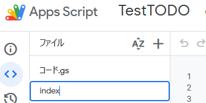
      - `dist`フォルダ内の`index.html`の内容を貼り付けてください。
      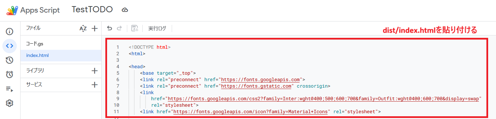
3. リポジトリのルートディレクトリにある`appscript.json`の内容を設定
   - プロジェクト設定から「appsscript.json マニフェストファイルをエディタで表示する」にチェックを入れます。
   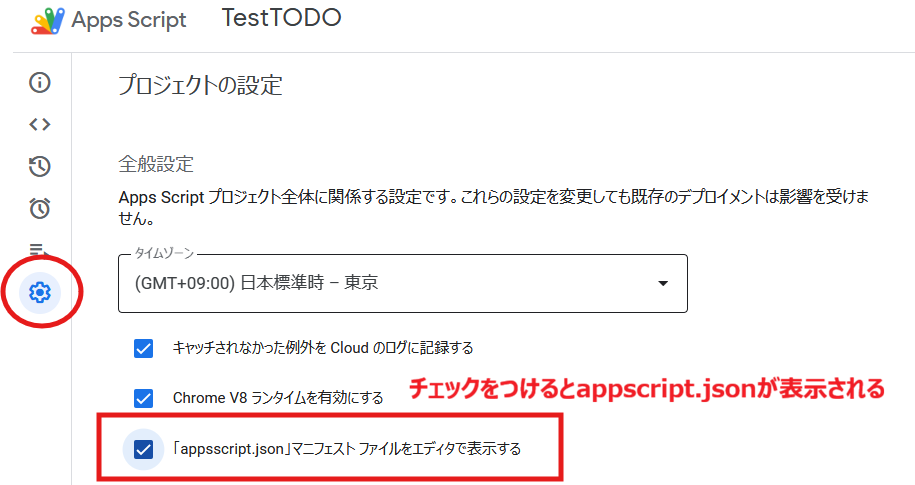
   - ファイルにappsscript.json`が表示されているので、その内容を全て書き換える形で上書きします。
   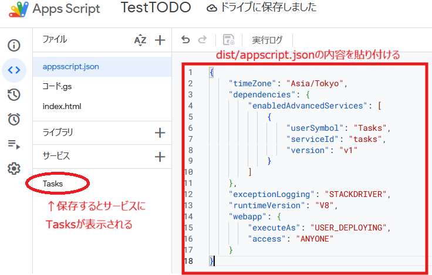

### 3. 設定ファイルの更新
1. ファイルを個別に登録した場合は、`AppConfig.js.sample` を `AppConfig.js` にリネームします。(※`コード.js`へ直接書き込んだ場合は不要です)
2. `SPREADSHEET_ID` を手順1で控えたIDに書き換えます。
　(コード.gsの最初の方にあります。AppConfig.jsも同様です。)

```javascript
const CONFIG = {
    SPREADSHEET_ID: 'YOUR_SPREADSHEET_ID_HERE', 
    // ...
```
   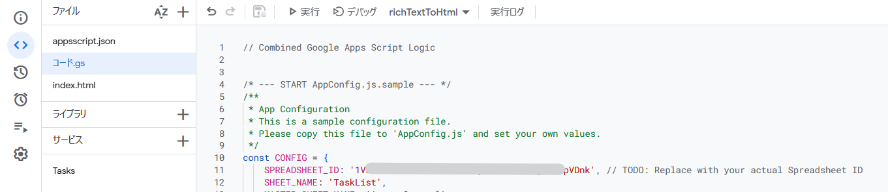

### 4. デプロイ
1. GASエディタ右上の「デプロイ」→「新しいデプロイ」を選択。
   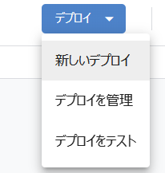
2. 種類: 「ウェブアプリ」。
   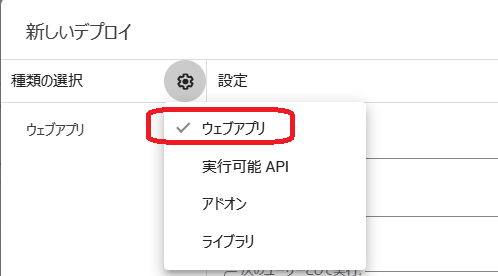
3. 次のユーザーとして実行: 「自分」。
4. アクセスできるユーザー: 「全員」または「自分のみ」。
   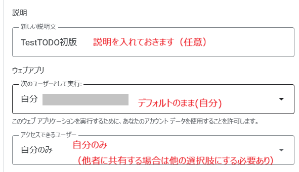
5. 権限の許可
   - 以下の画面が表示されたら、「アクセスを承認する」を押して許可する。
   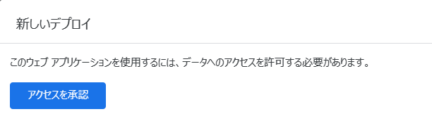
   - 「Advanced」を押す。
   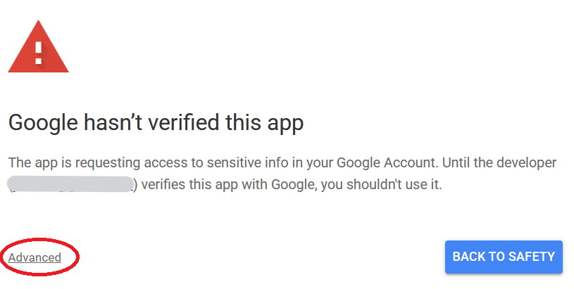
   - 「Go to <設定した名称> (unsafe)」を押す。
   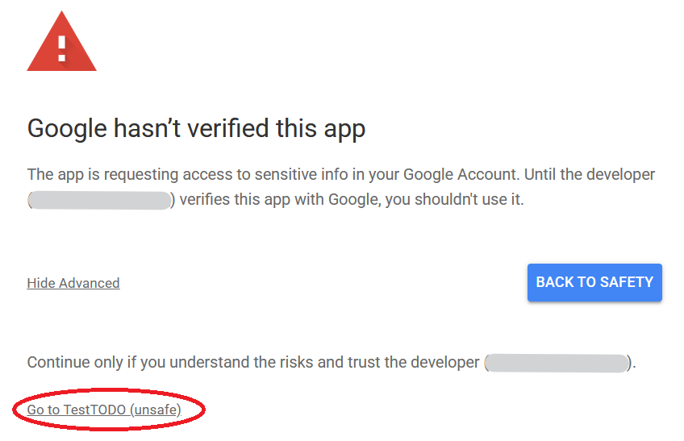
   - Google Spread SheetとTaskへのアクセス権限許可を確認されるので、「Select all」にチェックを入れ （または個別にチェック）「Continue」を押す。
   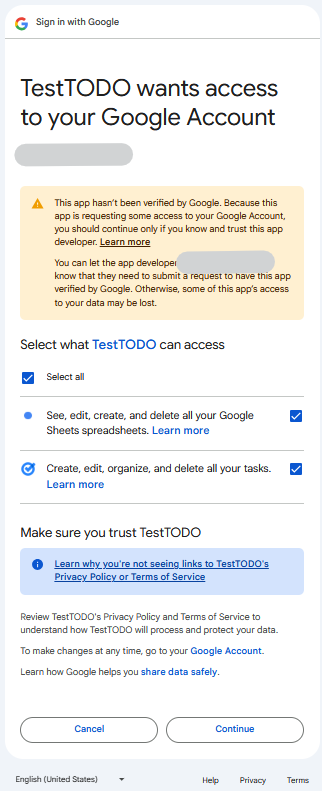
6. 発行されたウェブアプリURLにアクセス！
   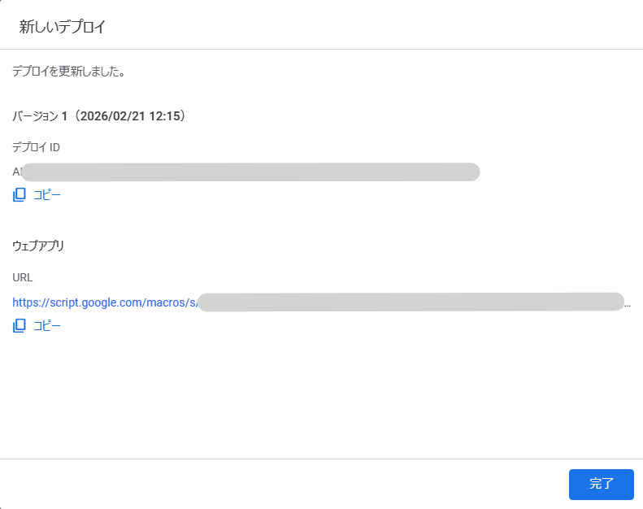

## Development(claspによるデプロイ)

開発者向けの手順です。

### Prerequisites
- Node.js
- clasp (`npm install -g @google/clasp`)

### Setup
```bash
# Clone repository
git clone https://github.com/your-username/MyTask.git
cd MyTask

# Login to Google
clasp login

# Create new GAS project (or clone existing)
clasp create --type webapp --title "MyTask"
# OR
clasp clone <scriptId>
```
### Deploy (clasp)
```bash
# Push Code
clasp push

# Deploy
clasp deploy
```
## Development(GASエディタによるデプロイ)

### Prerequisites
- Node.js

### Build & Bundle

複数のソースファイルを1つの `Code.gs` と `index.html` にまとめます。

```bash
node bundler.js
```
生成された `dist/` 配下のファイルをGASエディタへ貼り付けてください。


## License

MIT License
